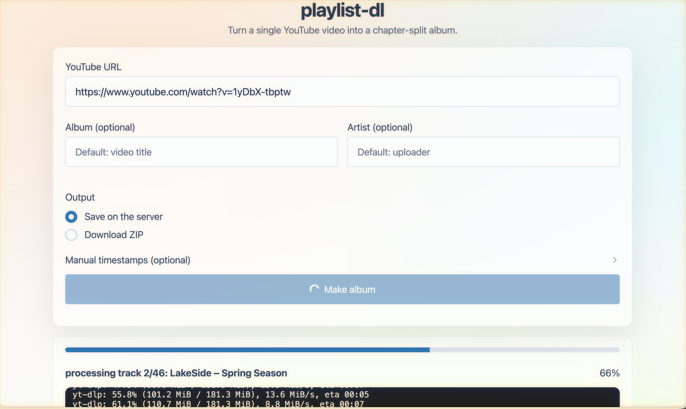
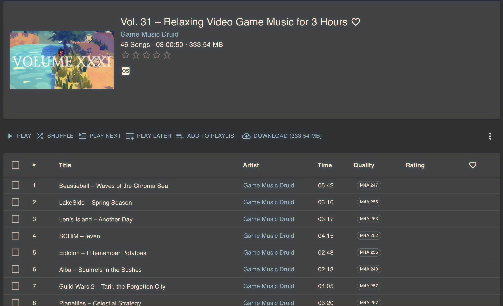

# playlist-dl (web)

Web UI for turning a single long YouTube video into an "album" by splitting audio into tracks from chapters (or manual timestamps).



Example output (Navidrome player):



## Prereqs

- `ffmpeg` installed and available on `PATH` (or set `FFMPEG_BIN`)
- Node.js 20+ installed and available on `PATH` (or set `YTDLP_NODE_PATH`)
- `yt-dlp-ejs` installed (included in `requirements.txt`)
- Python 3.10+

## Run

```bash
python3 -m venv .venv
source .venv/bin/activate
pip install -r requirements.txt

export PLAYLIST_DL_OUTPUT_DIR="$PWD/outputs"
# optional:
# export FFMPEG_BIN="/opt/homebrew/bin/ffmpeg"
# export YTDLP_NODE_PATH="/opt/homebrew/bin/node"
# export YTDLP_REMOTE_COMPONENTS="ejs:github"

uvicorn app.main:app --reload
```

Open `http://127.0.0.1:8000`.

## Debug yt-dlp locally (outside the web app)

This runs the same yt-dlp settings as the app, but prints verbose output + progress to your terminal:

```bash
python3 tools/debug_ytdlp.py "https://www.youtube.com/watch?v=..."
```

If YouTube is blocking the request (common on servers), export cookies:

```bash
export YTDLP_COOKIES="$HOME/Downloads/cookies.txt"
python3 tools/debug_ytdlp.py "https://www.youtube.com/watch?v=..."
```

## Notes

- Output files are `.m4a` (AAC) with embedded cover art when a thumbnail is available.
- "Download ZIP" jobs store results in a temp folder and expose a one-time-ish download link.
